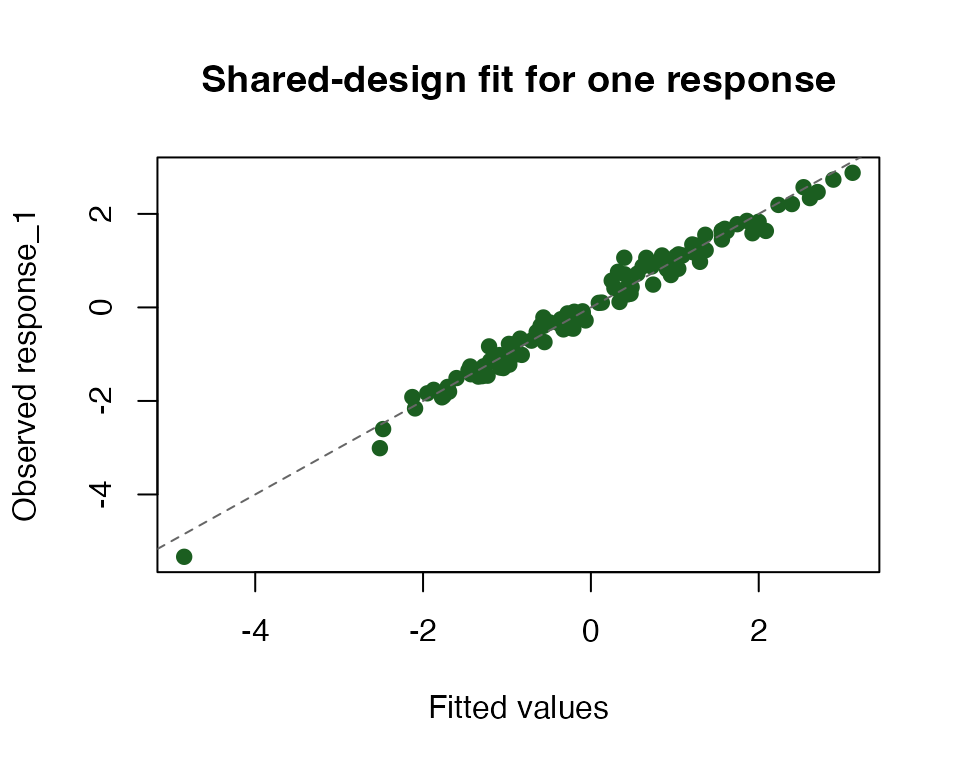

# Getting started with backend-aware matrices in amatrix

``` r

library(amatrix)
```

`amatrix` is for matrix-heavy code that already fits the `Matrix` idiom
but needs a cleaner path to accelerated execution. You keep ordinary
matrix inputs, wrap them once, and then use Matrix-compatible objects
that carry backend preferences into linear algebra and model fitting.

This vignette uses one common workload: one design matrix, many response
columns. By the end, you will have a backend-aware design matrix, a
shared-design QR fit from
[`many_lm()`](https://bbuchsbaum.github.io/amatrix/reference/many_lm.md),
and a compact way to inspect where `amatrix` plans to run each
operation.

## What do your inputs look like?

``` r

c(
  observations = nrow(X),
  predictors = ncol(X),
  responses = ncol(Y)
)
#> observations   predictors    responses 
#>          120            6            8
```

The design matrix `X` is an ordinary dense R matrix with one row per
observation and one column per predictor. The response matrix `Y` has
the same number of rows, but each column is a separate regression target
that shares the same design.

## What is the quickest end-to-end path?

``` r

X_am <- adgeMatrix(X)
fit <- many_lm(X_am, Y, method = "qr", include_fitted = TRUE, include_residuals = TRUE)
dim(coef(fit))
#> [1] 6 8
```

[`adgeMatrix()`](https://bbuchsbaum.github.io/amatrix/reference/adgeMatrix.md)
is the main dense-matrix constructor.
[`many_lm()`](https://bbuchsbaum.github.io/amatrix/reference/many_lm.md)
then fits all response columns against the same design in one call and
returns a coefficient matrix with one column per response.

## How does `amatrix` decide where to run?

``` r

amatrix_backend_status()[, c("name", "available", "precision_modes", "residency_capable")]
#>        name available precision_modes residency_capable
#> 1 arrayfire     FALSE            <NA>             FALSE
#> 2       cpu      TRUE     strict,fast             FALSE
#> 3     metal     FALSE            <NA>             FALSE
#> 4       mlx     FALSE            <NA>             FALSE
#> 5    opencl     FALSE            <NA>             FALSE
```

The status table tells you which backends are registered on the current
machine and whether they are usable right now. A backend can be
registered but unavailable, in which case the same code still has a
predictable CPU fallback.

``` r

plan <- amatrix_backend_plan(X_am, "qr")
plan[c("chosen", "chosen_path", "requested_precision")]
#> $chosen
#> [1] "cpu"
#> 
#> $chosen_path
#> [1] "cold"
#> 
#> $requested_precision
#> [1] "strict"
```

This plan is the compact view of a dispatch decision. You can see which
backend was chosen, whether the operation will run as a cold or resident
path, and which precision contract the object is requesting.

## When does shared-design caching help?

The main reason to use `amatrix` for repeated regression is that the
design-matrix factorization can be reused across calls when `X` stays
the same. That matters when you fit many batches of responses against
one shared design.

``` r

X_cache_am <- adgeMatrix(X)
fit_a <- many_lm(X_cache_am, Y[, 1:4, drop = FALSE], method = "qr", cache = TRUE)
fit_b <- many_lm(X_cache_am, Y[, 5:8, drop = FALSE], method = "qr", cache = TRUE)

c(first_call = fit_a$cache_reused, second_call = fit_b$cache_reused)
#>  first_call second_call 
#>       FALSE        TRUE
```

With a fresh backend-aware copy of `X`, the first call computes and
stores the QR factorization for that design. The second call reuses it
because the design matrix is unchanged.

## What should you inspect after a fit?

``` r

summary_tbl <- data.frame(
  response = colnames(Y),
  rss = round(fit$rss, 3),
  sigma2 = round(fit$sigma2, 4),
  r2 = round(r2, 3)
)

knitr::kable(summary_tbl, align = "lrrr")
```

|            | response   |   rss | sigma2 |    r2 |
|:-----------|:-----------|------:|-------:|------:|
| response_1 | response_1 | 4.402 | 0.0386 | 0.980 |
| response_2 | response_2 | 6.406 | 0.0562 | 0.964 |
| response_3 | response_3 | 3.696 | 0.0324 | 0.961 |
| response_4 | response_4 | 4.614 | 0.0405 | 0.992 |
| response_5 | response_5 | 4.157 | 0.0365 | 0.990 |
| response_6 | response_6 | 3.890 | 0.0341 | 0.994 |
| response_7 | response_7 | 4.913 | 0.0431 | 0.956 |
| response_8 | response_8 | 4.789 | 0.0420 | 0.949 |

`rss` and `sigma2` tell you how much unexplained variation remains in
each response. Here the fitted models recover most of the signal because
the responses were generated from a shared linear design with modest
noise.



The points fall close to the identity line, which matches the high `r2`
values from the hidden checks and the small residual variances in the
summary table.

## How do you ask for a fast backend?

The CPU path above is the safest default because it runs everywhere. On
a machine with an available accelerator backend, the code shape stays
the same and you only change the constructor metadata:

``` r

X_fast <- adgeMatrix(X, mode = "fast")
fit_fast <- many_lm(X_fast, Y, method = "qr", cache = TRUE)

coef(fit_fast)
```

If you are writing library code, the default path is still to wrap once
at the boundary and keep the rest of the code generic:

``` r

X_am <- as_adgeMatrix(X, mode = "fast")
fit <- many_lm(X_am, Y, method = "qr", cache = TRUE)
```

That per-object path does not require session-global setters or a
hardcoded backend name. `amatrix` will prefer an available fast-capable
accelerator automatically and fall back to CPU when none is available.

If a caller wants to flip defaults for one local block instead of one
object, use
[`with_amatrix()`](https://bbuchsbaum.github.io/amatrix/reference/with_amatrix.md):

``` r

with_amatrix(policy = "auto", precision = "fast", {
  X_am <- as_adgeMatrix(X)
  fit <- many_lm(X_am, Y, method = "qr", cache = TRUE)
})
```

Use
[`amatrix_bind_resident()`](https://bbuchsbaum.github.io/amatrix/reference/amatrix_bind_resident.md)
only when you need to optimize a particularly hot repeated path.

## Where next?

The next functions to explore are
[`adgeMatrix()`](https://bbuchsbaum.github.io/amatrix/reference/adgeMatrix.md),
[`many_lm()`](https://bbuchsbaum.github.io/amatrix/reference/many_lm.md),
[`amatrix_backend_status()`](https://bbuchsbaum.github.io/amatrix/reference/amatrix_backend_status.md),
and
[`amatrix_explain()`](https://bbuchsbaum.github.io/amatrix/reference/amatrix_explain.md).
If you want to audit a single operation more deeply, start with
[`amatrix_backend_plan()`](https://bbuchsbaum.github.io/amatrix/reference/amatrix_backend_plan.md)
and then compare that compact plan to the printed explanation from
[`amatrix_explain()`](https://bbuchsbaum.github.io/amatrix/reference/amatrix_explain.md).
